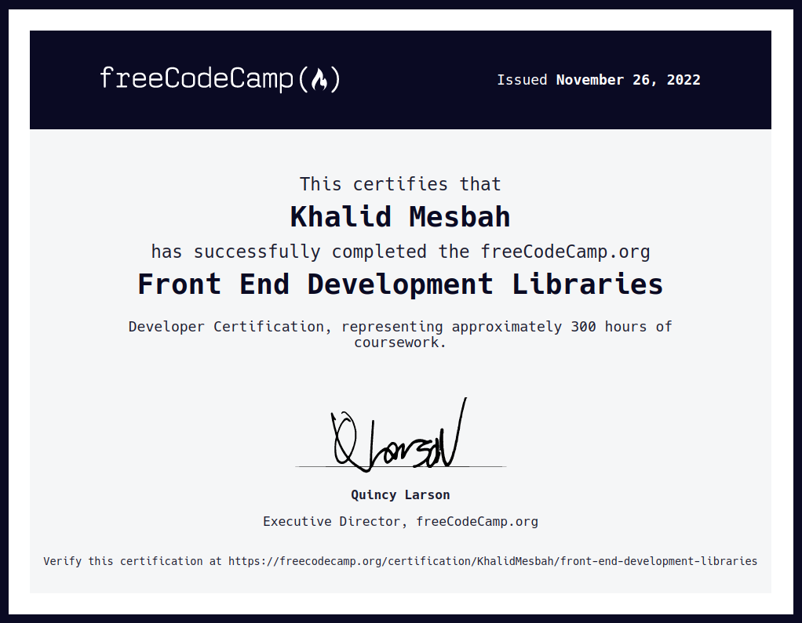

# Front-End-Development-Libraries Solutions
> My solutions to the FrontEnd Development Libraries Course Projects from freeCodeCamp.

## Credentials
[Show Credential](https://www.freecodecamp.org/certification/KhalidMesbah/front-end-development-libraries)

## Completed Projects
- [x] Random Quote Machine [Preview](https://codepen.io/KhalidMesbah/pen/XWYdVbJ)
- [x] Markdown Previewer [Preview](https://ivmg0l.csb.app/)
- [x] Drum Machine [Preview](https://codepen.io/KhalidMesbah/full/zYazbGg)
- [x] Calculator [Preview](https://orc1tj.csb.app/)
- [x] Pomodoro Timer [Preview](https://react-ts-brqxhz.stackblitz.io/)

## Certification

